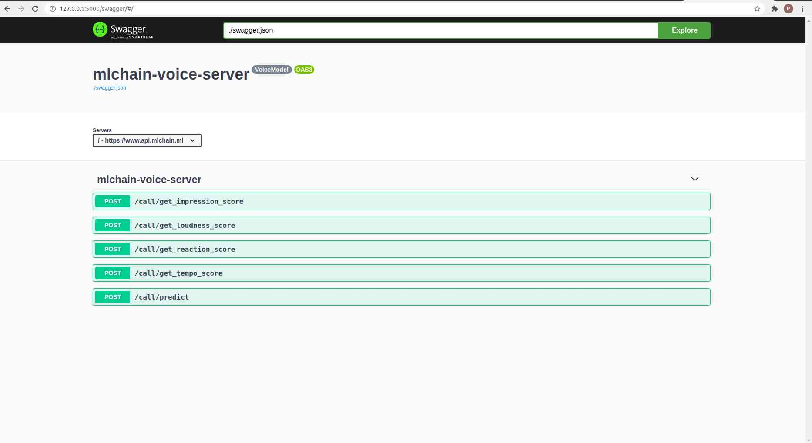

# AI interview scoring system

## Features
- Evaluate candidate's reaction, loudness and tempo score in 1-10 scale

## Requirements
- Python 3.6
- `python -m pip install -r requirements.txt`

## Usage
- Run `mlchain run` and you should see something like this:
```console
[2020-09-21 10:39:26 +0700] [14860] [INFO] Starting gunicorn 20.0.4
[2020-09-21 10:39:26 +0700] [14860] [INFO] Listening at: http://127.0.0.1:5000 (14860)
[2020-09-21 10:39:26 +0700] [14860] [INFO] Using worker: gthread
[2020-09-21 10:39:26 +0700] [14880] [INFO] Booting worker with pid: 14880
```
- Now you can access your API at http://localhost:5000
- You can open Swagger UI at http://localhost:5000/swagger and try your API out right away



## Cloud Run
 [](https://console.cloud.google.com/cloudshell/editor?shellonly=true&cloudshell_image=gcr.io/cloudrun/button&cloudshell_git_repo=https://github.com/dd-dos/voice_gcp_deploy.git)

